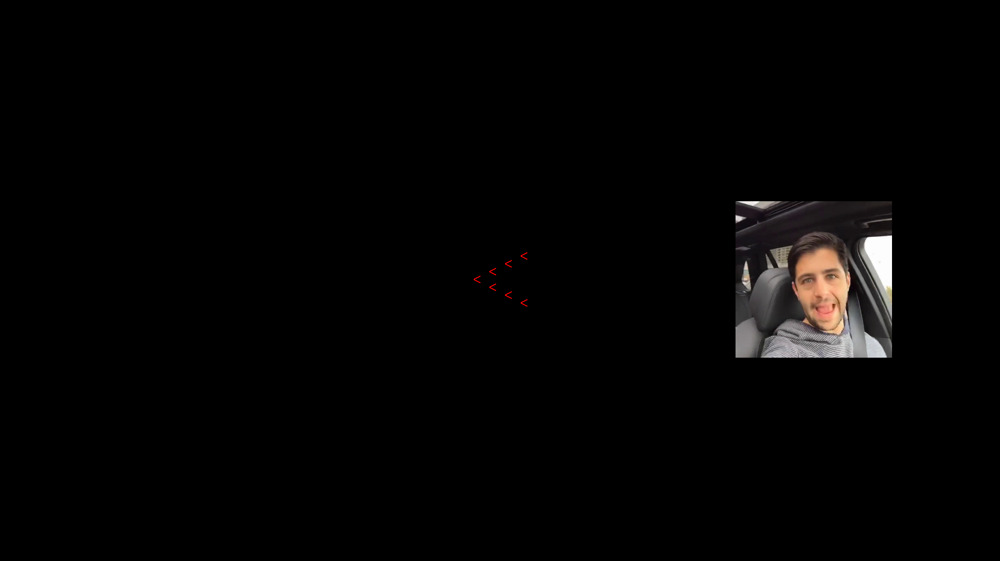

```{r setup, include = FALSE}
library(papaja)
library(ggpubr)
library(rio)
library(tidyverse)
```

```{r analysis-preferences}
# Seed for random number generation
set.seed(42)
knitr::opts_chunk$set(message=FALSE, warning=FALSE, cache = TRUE, cache.lazy = FALSE )
knitr::opts_knit$set(root.dir = here::here())
```

# Research Problem

> Research problem (10pts): Describe the task you want to achieve. What is the outcome of interest? What are you trying to predict? Why is it important? What are the potential benefits of having a predictive model for this outcome?

In every moment, humans have the choice between two different actions: *exploitation*, in which they continue engaging in a rewarding task. Alternatively, in the case of *exploration*, humans search the environment for potentially more rewarding, alternative things to do. The factors that determine disengagement from a rewarding task and exploratory behavior are unclear. Previous research suggests that switches from exploitation to exploration can be caused by increasing task uncertainty, elevated error rate in the current task, and lower task reward, or, together, task utility (for overviews, see @astonjones2005 and @cohen2007). Here, I aim to predict human distractibility from short videos while they are working on a rewarding task. To achieve this, I conducted an experiment in which task utility (i. e., reward), and task utility is systematically manipulated between experimental blocks. Eye-tracking reveals what subjects pay attention to - and this is the outcome I aim to predict from these two experimental variables. Additionally, I obtain frame-by-frame embeddings from ResNet-18 as predictors.

The general approach here is to compare the predictive performance of regularized regression models (i. e., lasso and ridge regression, and elastic net). It is of interest to me to which degree video content determines distractibility - thus, I will examine the degree to which frame-level embeddings improve regularized regression performance by comparing models with and without embeddings.

This research is important because it can help further our understanding about the situations and the cognitive processes underlying elevated distractibility in populations with ADHD or older adults, given that they often appear more distracted. Moreover, it is crucial for understanding the properties of stimuli that can draw attention away from a target and thus, this research may help improve driver assistance systems, for instance.

# Method

Data collection is still ongoing. Currently, data from 16 undergraduate students, collected at the University of Oregon is available. However, for four subjects, eye tracking data is missing - therefore, models were trained with data from twelve subjects.

The experiment was programmed in Matlab 2022a [@MATLAB] using Psychtoolbox 3 [@PTB1; @PTB2; @PTB3]. In this experiment, participants perform a series of blocks of trials with a simple computer task. In each trial, an arrow is presented on the screen, pointing into directions of multiples of 90° (up, right, down, left). The arrow can appear in four different colors (red, green, blue, yellow). The subject completes a trial by pressing a key on the numpad dependent on the color (blue - 8, green - 6, red - 2, yellow - 5). Each block is time limited to 60 seconds and participants can earn monetary incentives dependent on accurate performance in a block. Thus, the rational goal would be to "exploit" this task and perform fast and accurately to maximize the reward. However, participants could also "explore" the environment - in 50 % of the trials, videos appeared far or close to the left or right of the arrow. The pool of videos that was generated and used for this experiment was downloaded from the social media website vine.co. and consists of 500 videos with an average duration of 3-6 seconds. For an example, see Figure \@ref(fig:task). Using an SR Research Eyetracker, I measured the eye position on the screen at 1000 Hz.



Multiple experimental manipulations were implemented, and I will focus on the relevant factors here. First, I included a reward manipulation - in half of the blocks, participants could earn/lose \$0.01 per correct/incorrect trial (high reward) whereas in the other half, participants could only earn/lose \$0.001 per correct/incorrect trial (low reward condition). Participants typically earned \$4 - \$5 throughout the experiment.

Second, I manipulated the inter-trial-interval - in half of the blocks, the time between trials with a blank screen was set to 0.5 s, in the other half to 1.5 s. With this manipulation, I changed the possible exploitation rate per block, which has an impact on the rate of exploration, following from this formula:

$$time cost_{exploration} = \frac{time_{exploration}}{time_{exploitation}}$$

This implies that if a trial (including the inter-trial-interval) is long, the cost of exploration is relatively low, hence, a higher overall rate of checking the videos (and thus, distractibility) should be apparent. In other words, if a trial takes longer to complete, the relative time cost of exploration (assuming that the time needed to explore remains constant) is lower. In so far unpublished studies, our group confirmed that exploratory behavior do indeed vary according to this formula if the denominator is manipulated [@ahmad2023; @gratz2022; @gratz2023].

# Behavioral results and checking behavior

Before I am presenting the models, it is helpful to visualize distractability in the current sample, dependent on the experimental conditions. For an initial analysis, for each trial it was determined whether the subject inspected the video (coded as 1 if yes, 0 otherwise). For each condition and subject, the average of this variable was then calculated, representing the average video checking probability. Statistical results will not be presented here, but numerically, average effects are as expected - longer inter-trial-interval and lower reward were expected to reduce the cost of exploring the videos and this trend seems to be present in the data (Figure \@ref(fig:behavioral) ). This figure reveals that video checking behavior shows large variation between individuals.

```{r behavioral, fig.cap="Behavioral results. **A:** Distractibility by subject. **B:** Errorbars represent within-subjects design corrected 95 % confidence intervals. Probabilities for distraction were obtained by dividing the number of trials with an gaze on the video by the number of trials, separately for each condition."}


#function to calculate within-subjects data that can be used to calculate within-subjects errorbars
normWS <- function(d ,s, dv, between = NULL) {
  eval(substitute(d %>%
                    dplyr::group_by(s) %>%
                    dplyr::mutate(sAV = mean(dv, na.rm = TRUE)) %>%
                    dplyr::group_by_at(between) %>% #this is grouping by between subjects variables
                    dplyr::mutate(gAV = mean(dv, na.rm = TRUE)) %>%
                    dplyr::mutate(DV_n = dv - sAV + gAV), list(s = as.name(s), dv = as.name(dv))))
}


files <- list.files("data", pattern = "txt", full.names = TRUE)
data <- list()

for (i in 1:length(files)){
  data[[i]] <- import(files[i], na.strings = "NaN") %>% mutate(RewardCond = as.character(RewardCond))
}

data <- bind_rows(data)

data <- data %>%
  filter(!is.na(RT) &
         Practice == 0) %>%
  mutate(VideoCheck = ifelse(DT > 0, 1, VideoCheck),
         ITI = factor(ITI),
         Conflict = factor(Conflict),
         ID = factor(ID),
         VideoCheck_bi = ifelse(VideoCheck > 0 , 1, 0))


distraction_subj <- data %>% 
  filter((VideoStart == "auto" & Video_present == 1)) %>% 
  group_by(ID, Block, VideoStart, RewardCond, ITI) %>%
  summarize(M = mean(VideoCheck_bi)) %>%
  group_by(ID, VideoStart,  RewardCond, ITI) %>%
  summarize(M = mean(M))

distraction_agg <- distraction_subj %>%
  normWS(s = "ID", dv = "M") %>%
  group_by(VideoStart,  RewardCond, ITI) %>%
  summarize(SD = sd(M),
            M = mean(M),
            N = n(),
            SD_within = sd(DV_n), 
            M_within = mean(DV_n),
            SE_within = SD_within/sqrt(N),
            CI_within = abs(SE_within*(qt(.025, N - 1))),
            CI_upr_within = M_within + CI_within,
            CI_lwr_within = M_within - CI_within,
            SE = SD/sqrt(N),
            CI = abs(SE*(qt(.025, N - 1))),
            CI_upr = M + CI,
            CI_lwr = M - CI)


plt1 <- ggplot(distraction_subj, aes(x = ITI, y = M, color = ID, linetype = RewardCond, group = RewardCond))+
  geom_line()+
  geom_point()+
  scale_color_viridis_d(option = "plasma", end = .95)+
  labs(x = "Inter-Trial-Interval (s)",
       y = "p(Distraction)")+
  scale_linetype_discrete(name = "Reward")+
  facet_wrap(~ID)+
  guides(color = FALSE)+
  theme_classic()+
  theme(legend.position = "bottom")

pos <- position_dodge(width = 0.1)

plt2 <- ggplot(distraction_agg, aes(x = ITI, y = M, linetype = RewardCond, group = RewardCond))+
  geom_line(lwd = 1.5, position = pos)+
  geom_point(size = 2, position = pos)+
  geom_errorbar(aes(ymin = CI_lwr_within, ymax = CI_upr_within), width = 0.2, position = pos)+
  labs(x = "Inter-Trial-Interval (s)",
       y = "p(Distraction)")+
  guides(linetype = FALSE)+
  theme_classic()


plot <- ggarrange(plt1, plt2, labels = c("A", "B"))
plot <- annotate_figure(plot, top = text_grob("Distractibility varies by experimental conditions", face = "bold", size = 14))
plot
```

# Data preprocessing

All analyses were conducted using R [@R] in RStudio [@RStudio]. For data processing, wrangling, and visualization, the rio [@rio] and tidyverse [@tidyverse] packages were used.

To model the degree to which people are distracted in these situations, I used a more fine-grained approach with the goal to predict distractibility for each video frame.

For each experimental session, two data files are present - eye-tracking data contains information about gaze behavior during the experiment, the behavioral data file contains trial-level information about the experimental conditions, responses and video shown.

I first prepared the eye-tracking data. The raw eye-tracking data consists of one row per millisecond with information about time stamp, and x and y position on the screen. From the message data frame within the eye-tracking data, I identified information about experimental blocks, trials and video frame onsets and merged this with the raw eye-tracking data described above. The eye-tracking data file also provides information about blinks, most importantly blink onsets and ends. Time stamps during which blinks occurred were then removed from the enriched eye-tracking data frame. Now, for each millisecond, information about time (from trial onset), eye position, experimental blocks and trials and video frame number was present. I then merged the eye-tracking data with the behavioral data, specifically to add information about the video that was presented and its location (left/right, close/far from the task stimulus). For each row, I then determined whether the gaze was inside the area the video was presented (coded as 1), or not (coded as 0) - this is my distraction indicator, and the outcome variable I aim to predict. This resulted in a data frame with highly redundant information because consecutive rows within a given frame could only differ with respect to the time stamp and the distraction indicator. I reduced the redundancy and the size of the data set by keeping only one row of per subject x trial x video frame. The distraction indicator is now coded such that one or more time stamps in which the gaze was inside the video ROI is a 1, and no video inspection a 0.

## Obtaining video frame embeddings

Using ffmpeg and the imager [@imager] package in R, I saved each frame from each of the 500 videos as an image. Embeddings for each of these frames were then obtained using the reticulate package [@reticulate] and the img2vec library [@img2vec]. Resnet-18 was the model selected because its output vectors are shortest with a length of 512, relative to the other available models in the img2vec library. 

The embeddings were then merged with the frame-by-frame data set above.

# Description of the final data

```{r read-in}
logistic_img_content <- readRDS( "analysis/results/caret_img_content.RDS")
logistic_no_img_content <- readRDS("analysis/results/caret_no_img_content.RDS")
#logistic_img_content <- logistic_no_img_content

train <- readRDS("analysis/results/train_data.RDS")
test <- readRDS("analysis/results/test_data.RDS")
```

> Description of the data (15pts): Describe core features of the data, any additional features you produced from existing features and how, basic descriptive statistics about these features, and any missing data analysis you conduct. The description should be sufficiently clear that the instructor understands all the variables included in your modeling.

The final data set consists of `r nrow(test$noimg_content) + nrow(train$noimg_content)` observations. Each observation represents a video frame presented in the experiment with the following (model-relevant) columns: ID, Time stamp, ITI condition, Reward condition, the 512 embeddings (all predictors) and the outcome, whether the gaze was on the video (coded as 1) or not (coded as 0). For example observations without embeddings, see Table \@ref(tab:datatable).

\@ref(fig:fit-overall)
```{r datatable}

papaja::apa_table(train$no_img_content %>% head(10), caption = "The first ten rows of the training data set without frame embeddings. The training data set with frame embeddings is identical, but has 512 more columns in the format VX (where X stands for a number in the range [1; 512]) for the frame embeddings.")

```


# Description of the models

> Apply at least three different modeling approaches to predict the outcome in the dataset. Describe any specific setting used during the model fitting (e.g., hyperparameter tuning, cross-validation). Also, discuss how you plan to evaluate model performance.

Models were built in R [@R] using R Studio [@RStudio] with the packages caret [@caret], and glmnet [@glmnet]. Ridge regression, lasso regression and elastic net models were selected as predictive model candidates. All numeric predictors were standardized and factors were one-hot coded (subject ID, inter-trial-interval condition, reward condition). Models were trained on 90 % of the data with 10-fold cross-validation and evaluated on the remaining 10 % test set. For hyperparameter tuning, the respective parameters were initially selected to span a relatively wide possible range at which model fit is expected to be improved. Models were generated multiple times, each time reducing the range of the respective hyperparameters to the range at which model improvement was visible in the previous iteration to find the best hyperparameters. LogLoss was the metric by which the final model was selected for each procedure. Model performance on the test set will evaluated based on overall accuracy, false positive, false negative, true positive and true negative rates.


# Model Fit

```{r tuning, out.width="90%", fig.height = 9, fig.cap="Tuning results for all models. The red circle represents the best tune out of the hyperparameter grid specified. Each row represent the tuning results for the regularized regression types (Lasso Regression: A, B; Ridge Regression: C, D; Elastic Net: E, F). Figures in the left column show the tuning results for the respective models including frame embeddings as predictors (A, C, E) or without frame embeddings as predictors (B, D, F). Red circles indicate the best tune."}

get_best_tune <- function(model){
  #this makes the ggplot function less busy. model$bestTune does not return the logloss value. This function extracts the entire row.
  model$results[which.min(model$results$logLoss),]
}

scaleFUN <- function(x) sprintf("%.4f", x)

tuning_plots <- list()

tuning_plots$img_lr <- 
  ggplot(logistic_img_content$lr$results, aes(x = lambda, y = logLoss))+
  geom_point()+
  geom_line()+
  geom_point(data = get_best_tune(logistic_img_content$lr), color = "red", size = 5, shape = 1)+
  scale_y_continuous(labels=scaleFUN)+
  labs(title = "W/ frame embeddings",
       y = "Lasso Regression\nLogLoss")+
  theme_classic()+
  theme(axis.text.x = element_text(angle = 45, hjust = 1),
        axis.title.x = element_blank())

tuning_plots$img_rr <- 
ggplot(logistic_img_content$rr$results, aes(x = lambda, y = logLoss))+
  geom_point()+
  geom_line()+
  geom_point(data = get_best_tune(logistic_img_content$rr), color = "red", size = 5, shape = 1)+
  scale_y_continuous(labels=scaleFUN)+
  labs(y = "Ridge Regression\nLogLoss")+
  theme_classic()+
  theme(axis.text.x = element_text(angle = 45, hjust = 1),
        axis.title.x= element_blank())

tuning_plots$img_en <- 
ggplot(logistic_img_content$en$results, aes(x = lambda, y = logLoss, color = alpha, group = alpha))+
  geom_point()+
  geom_line()+
  geom_point(data = get_best_tune(logistic_img_content$en), color = "red", size = 5, shape = 1)+
  scale_y_continuous(labels=scaleFUN)+
  labs(y = "Elastic Net\nLogLoss")+
  geom_text(data = logistic_img_content$en$results %>% filter(lambda == 0.001),
            aes(x = 0.00103, y = logLoss, label = round(alpha, 2)), hjust = 0, size = 3, color = "black")+
  annotate("text", x = 0.00103, y = 0.2897, label = "alpha", hjust = 0, size = 3, color = "black")+
  scale_color_viridis_c(end = 0.95)+
  theme_classic()+
  theme(legend.position = "none",
        axis.text.x = element_text(angle = 45, hjust = 1))


#########################

tuning_plots$noimg_lr <- 
ggplot(logistic_no_img_content$lr$results, aes(x = lambda, y = logLoss))+
  geom_point()+
  geom_line()+
  geom_point(data = get_best_tune(logistic_no_img_content$lr), color = "red", size = 5, shape = 1)+
  scale_y_continuous(labels=scaleFUN)+
  labs(title = "W/o frame embeddings",
       y = "")+
  theme_classic()+
  theme(axis.text.x = element_text(angle = 45, hjust = 1),
        axis.title.x = element_blank())

tuning_plots$noimg_rr <- 
ggplot(logistic_no_img_content$rr$results, aes(x = lambda, y = logLoss))+
  geom_point()+
  geom_line()+
  geom_point(data = get_best_tune(logistic_no_img_content$rr), color = "red", size = 5, shape = 1)+
  scale_y_continuous(labels=scaleFUN)+
  labs(y = "")+
  theme_classic()+
  theme(axis.text.x = element_text(angle = 45, hjust = 1),
        axis.title.x = element_blank())

tuning_plots$noimg_en <- 
ggplot(logistic_no_img_content$en$results %>% filter(alpha != 0.001), aes(x = lambda, y = logLoss, color = alpha, group = alpha))+
  geom_point()+
  geom_line()+
  geom_point(data = get_best_tune(logistic_no_img_content$en), color = "red", size = 5, shape = 1)+
  scale_y_continuous(labels=scaleFUN)+ 
  geom_text(data = logistic_no_img_content$en$results %>% filter(alpha != 0.001 & lambda == 0.001),
            aes(x = 0.00103, y = logLoss, label = round(alpha, 2)), hjust = 0, size = 3, color = "black")+
  annotate("text", x = 0.00103, y = 0.308775, label = "alpha", hjust = 0, size = 3, color = "black")+
  scale_color_viridis_c(end = 0.95)+
  labs(y = "")+
  theme_classic()+
  theme(legend.position = "none",
        axis.text.x = element_text(angle = 45, hjust = 1))

fig <- ggarrange(tuning_plots$img_lr,
                 tuning_plots$noimg_lr, 
                 tuning_plots$img_rr, 
                 tuning_plots$noimg_rr,
                 tuning_plots$img_en, 
                 tuning_plots$noimg_en, ncol = 2, nrow = 3, labels = c("A", "B", "C", "D", "E", "F"))
annotate_figure(fig, top = text_grob("Tuning results for all models", face = "bold", size = 14))


```


```{r get-predictions}

predictions <- data.frame(
  pred_img_en =    predict(logistic_img_content$en,    test$img_content),
  pred_img_lr =    predict(logistic_img_content$lr,    test$img_content),
  pred_img_rr =    predict(logistic_img_content$rr,    test$img_content),
  pred_no_img_en = predict(logistic_no_img_content$en, test$img_content),
  pred_no_img_lr = predict(logistic_no_img_content$lr, test$img_content),
  pred_no_img_rr = predict(logistic_no_img_content$rr, test$img_content))

# predictions <- predictions %>%
#   mutate_at(vars(starts_with("pred_")), ~ifelse(. == "check", 1, 0))

test_data <- cbind(predictions, test$img_content)

# Accuracy
Acc <- function(prediction, actual){
  return(sum(prediction == actual)/length(actual))
}

#True Positives
TP <- function(prediction, actual, positive){
  sum(prediction == positive & actual == positive)/sum(actual == positive)
}

#False Positives
FP <- function(prediction, actual, positive){
  sum(prediction == positive & actual != positive)/sum(actual != positive)
}

#True Negatives
TN <- function(prediction, actual, positive){
  sum(prediction != positive & actual != positive)/sum(actual != positive)
}

#False Negatives
FN <- function(prediction, actual, positive){
  sum(prediction != positive & actual == positive)/sum(actual == positive)
}

results_overall <- test_data %>%
  summarize(Acc_img_en    = Acc(pred_img_en   , isInVid),
            Acc_img_lr    = Acc(pred_img_lr   , isInVid),
            Acc_img_rr    = Acc(pred_img_rr   , isInVid),
            Acc_noimg_en  = Acc(pred_no_img_en, isInVid),
            Acc_noimg_lr  = Acc(pred_no_img_lr, isInVid),
            Acc_noimg_rr  = Acc(pred_no_img_rr, isInVid),
            TP_img_en     = TP (pred_img_en   , isInVid, "check"),
            TP_img_lr     = TP (pred_img_lr   , isInVid, "check"),
            TP_img_rr     = TP (pred_img_rr   , isInVid, "check"),
            TP_noimg_en   = TP (pred_no_img_en, isInVid, "check"),
            TP_noimg_lr   = TP (pred_no_img_lr, isInVid, "check"),
            TP_noimg_rr   = TP (pred_no_img_rr, isInVid, "check"),
            FP_img_en     = FP (pred_img_en   , isInVid, "check"),
            FP_img_lr     = FP (pred_img_lr   , isInVid, "check"),
            FP_img_rr     = FP (pred_img_rr   , isInVid, "check"),
            FP_noimg_en   = FP (pred_no_img_en, isInVid, "check"),
            FP_noimg_lr   = FP (pred_no_img_lr, isInVid, "check"),
            FP_noimg_rr   = FP (pred_no_img_rr, isInVid, "check"),
            TN_img_en     = TN (pred_img_en   , isInVid, "check"),
            TN_img_lr     = TN (pred_img_lr   , isInVid, "check"),
            TN_img_rr     = TN (pred_img_rr   , isInVid, "check"),
            TN_noimg_en   = TN (pred_no_img_en, isInVid, "check"),
            TN_noimg_lr   = TN (pred_no_img_lr, isInVid, "check"),
            TN_noimg_rr   = TN (pred_no_img_rr, isInVid, "check"),
            FN_img_en     = FN (pred_img_en   , isInVid, "check"),
            FN_img_lr     = FN (pred_img_lr   , isInVid, "check"),
            FN_img_rr     = FN (pred_img_rr   , isInVid, "check"),
            FN_noimg_en   = FN (pred_no_img_en, isInVid, "check"),
            FN_noimg_lr   = FN (pred_no_img_lr, isInVid, "check"),
            FN_noimg_rr   = FN (pred_no_img_rr, isInVid, "check"))


results_ID <- test_data %>%
  group_by(ID) %>%
  summarize(Acc_img_en    = Acc(pred_img_en   , isInVid),
            Acc_img_lr    = Acc(pred_img_lr   , isInVid),
            Acc_img_rr    = Acc(pred_img_rr   , isInVid),
            Acc_noimg_en  = Acc(pred_no_img_en, isInVid),
            Acc_noimg_lr  = Acc(pred_no_img_lr, isInVid),
            Acc_noimg_rr  = Acc(pred_no_img_rr, isInVid),
            TP_img_en     = TP (pred_img_en   , isInVid, "check"),
            TP_img_lr     = TP (pred_img_lr   , isInVid, "check"),
            TP_img_rr     = TP (pred_img_rr   , isInVid, "check"),
            TP_noimg_en   = TP (pred_no_img_en, isInVid, "check"),
            TP_noimg_lr   = TP (pred_no_img_lr, isInVid, "check"),
            TP_noimg_rr   = TP (pred_no_img_rr, isInVid, "check"),
            FP_img_en     = FP (pred_img_en   , isInVid, "check"),
            FP_img_lr     = FP (pred_img_lr   , isInVid, "check"),
            FP_img_rr     = FP (pred_img_rr   , isInVid, "check"),
            FP_noimg_en   = FP (pred_no_img_en, isInVid, "check"),
            FP_noimg_lr   = FP (pred_no_img_lr, isInVid, "check"),
            FP_noimg_rr   = FP (pred_no_img_rr, isInVid, "check"),
            TN_img_en     = TN (pred_img_en   , isInVid, "check"),
            TN_img_lr     = TN (pred_img_lr   , isInVid, "check"),
            TN_img_rr     = TN (pred_img_rr   , isInVid, "check"),
            TN_noimg_en   = TN (pred_no_img_en, isInVid, "check"),
            TN_noimg_lr   = TN (pred_no_img_lr, isInVid, "check"),
            TN_noimg_rr   = TN (pred_no_img_rr, isInVid, "check"),
            FN_img_en     = FN (pred_img_en   , isInVid, "check"),
            FN_img_lr     = FN (pred_img_lr   , isInVid, "check"),
            FN_img_rr     = FN (pred_img_rr   , isInVid, "check"),
            FN_noimg_en   = FN (pred_no_img_en, isInVid, "check"),
            FN_noimg_lr   = FN (pred_no_img_lr, isInVid, "check"),
            FN_noimg_rr   = FN (pred_no_img_rr, isInVid, "check"))
 

measures_overall <- results_overall %>% 
  pivot_longer(names_sep = "_", names_to = c("measure", "predictors", "model"), cols = everything()) %>%
  mutate(measure = factor(measure, levels = c("Acc", "TP", "TN", "FP", "FN")))

measures_ID <- results_ID %>% 
  pivot_longer(names_sep = "_", names_to = c("measure", "predictors", "model"), cols = contains("img")) %>%
  mutate(measure = factor(measure, levels = c("Acc", "TP", "TN", "FP", "FN")))

# measures_ID %>% group_by(ID, measure, model) %>% summarize(diff = value[predictors == "img"]-value[predictors == "noimg"]) %>% print(n = 200)

```

```{r fit-overall, out.width="95%", fig.height = 6, fig.cap="Performance of the regularized regression models with and without frame embeddings as predictors on the test set (10 \\% of the data). Performance on all metrics is better if frame embeddings are available as predictors on all metrics. This effect is emphasized for the true positive and false negative rate. Performance differences between regularized regression type are negligible for accuracy, true negative and false positive rates and are more pronounced for true positive rates and false negative rates."}
pos <- position_dodge(width = 0.4)
ggplot(measures_overall, aes(x = predictors, y = value, color = model, group = model))+
  geom_point(position = pos)+
  geom_line(position = pos)+
  labs(title = "Overall Predictive Performance on test data",
       x = "Model predictors",
       y = "Rate")+
  facet_wrap(~measure, labeller = labeller(measure = c("FN" = "False Negative",
                                                       "Acc" = "Accuracy",
                                                       "TP" = "True Positive",
                                                       "FP" = "False Positive",
                                                       "TN" = "True Negative")),
             nrow = 1)+
  scale_color_viridis_d(name = "Regression Type", 
                       labels = c("en" = "Elastic Net",
                                  "lr" = "Lasso Regression",
                                  "rr" = "Ridge Regression"),
                       option = "plasma", 
                       end = 0.9)+
  scale_x_discrete(labels = c("img" = "w/ frame\n embeddings",
                              "noimg" = "w/o frame\n embeddings"))+
  theme_classic()+
  theme(legend.position = "bottom",
        axis.text.x = element_text(angle = 45, hjust = 1))
```

```{r fit-ID, out.width="95%", fig.height = 6, fig.cap="Performance of the regularized regression models with and without frame embeddings as predictors on the test set (10 \\% of the data), by subject. Note the differences in performance between subjects."}
pos <- position_dodge(width = 0.4)
ggplot(measures_ID, aes(x = predictors, y = value, color = model, group = interaction(ID, model)))+
  geom_point(position = pos)+
  geom_line(position = pos)+
  labs(title = "Predictive Performance on test data by subject",
       x = "Model predictors",
       y = "Rate")+
  facet_wrap(~measure, 
             labeller = labeller(measure = c("FN" = "False Negative",
                                                       "Acc" = "Accuracy",
                                                       "TP" = "True Positive",
                                                       "FP" = "False Positive",
                                                       "TN" = "True Negative")),
             nrow = 1)+
  scale_color_viridis_d(name = "Regression Type", 
                       labels = c("en" = "Elastic Net",
                                  "lr" = "Lasso Regression",
                                  "rr" = "Ridge Regression"),
                       option = "plasma", 
                       end = 0.9)+
  scale_x_discrete(labels = c("img" = "w/ frame\n embeddings",
                              "noimg" = "w/o frame\n embeddings"))+
  theme_classic()+
  theme(legend.position = "bottom",
        axis.text.x = element_text(angle = 45, hjust = 1))

```

> Model fit (20pts): Provide the results of your model evaluation. Compare and contrasts results from different modeling approaches, including a discussion of model performance. Discuss your final model selection and the evidence that led you to this selection. If it is a classification problem, how did you choose a cut-off point for binary predictions? Did you consider different cut-off points?

The models were tested on 10 % data that was withheld from training the models. Accuracy, true positive, false positive, true negative and false negative rates were calculated for the entire test set, separate for regularized regression type (ridge regression vs. lasso regression vs. and elastic net) and predictors included (including frame embeddings vs. not including frame embeddings). Additionally, these metrics are also calculated within individuals so that model performance can be evaluated per subject.

## Overall performance

Accuracy, true positive, true negative, false positive and false negative rates of all models are communicated in Figure \@ref(fig:fit-overall). First of all, all models perform better when frame embeddings are added as predictors. Accuracy for all models is above `r round(measures_overall[measures_overall$measure == "Acc",]$value %>% min(), 2)`. Performance differences between the regression types are negligible for the accuracy metric. While this initially sounds like a good model performance, it is important to evaluate the other metrics. Importantly, given the relatively low rate of video inspection (see Figure \@ref(fig:behavioral)), we must consider the other metrics. The true positive rate for all models is above `r round(measures_overall[measures_overall$measure == "TP",]$value %>% min(), 2)`. Relative to all other models, lasso regression with frame predictors identifies most of the video checks, with a rate of `r round(measures_overall[measures_overall$measure == "TP" & measures_overall$predictors == "img" & measures_overall$model == "lr",]$value, 2)`. This rate is  close to chance level which indicates that the models at hand perform poorly in this key metric. Performance of all models is good when it comes to identifying frames that were not checked (true negative rate), with a minimum of `r round(measures_overall[measures_overall$measure == "TN",]$value %>% min(), 2)` across all models. Additionally, few frames were incorrectly classified as inspected, with a maximum false positive error rate of `r round(measures_overall[measures_overall$measure == "FP",]$value %>% max(), 2)` across all models. Performance is again poor for the false negative classification - errors are lower than `r round(measures_overall[measures_overall$measure == "FN",]$value %>% max(), 2)` for all models, and the lasso regression model with video frame predictors performs best with a false negative rate of `r round(measures_overall[measures_overall$measure == "FN" & measures_overall$predictors == "img" & measures_overall$model == "lr",]$value, 2)`.

The pattern of true negative and false positive metrics indicates a strong bias of the model to classify a frame as not being checked. This is clearly driven by the baseline differences in video checking rate (which is relatively low, see Figure \@ref(fig:behavioral)). Since true positives and false negatives, as well as true negatives and false positives are not independent metrics, the symmetric pattern we observe is not surprising. While models with frame embeddings generally do perform better than those without, this difference is only meaningful for the true positive rate and the false negative rate - for these measures, 'knowledge' of image content significantly improves the prediction of video inspection `r round((measures_overall[measures_overall$measure == "TP" & measures_overall$predictors == "img" & measures_overall$model == "lr",]$value/measures_overall[measures_overall$measure == "TP" & measures_overall$predictors == "noimg" & measures_overall$model == "lr",]$value)-1, 2)*100` %. It is also only for these metrics that performance differences by model become pronounced - lasso regression performs better than regardless of the availability of frame embeddings as predictors. However, even the best fitting model is still not very good at predicting frame-by-frame distraction. 
Additionally, it should be noted that the relatively high accuracy score cited above is misleading and driven by baseline differences in checking behavior.

## Model performance on the subject-level

Model performance per individual for all models with and without frames as predictors is presented in Figure \@ref(fig:fit-ID). There is a significant amount of between-subjects variability in how well the models can predict distractibility on a frame-by-frame basis. The range for accuracy is [`r round(measures_ID[measures_ID$measure == "Acc",]$value %>% min(), 2)`; `r round(measures_ID[measures_ID$measure == "Acc",]$value %>% max(), 2)`], for the true positive rate [`r round(measures_ID[measures_ID$measure == "TP",]$value %>% min(), 2)`; `r round(measures_ID[measures_ID$measure == "TP",]$value %>% max(), 2)`], for the true negative rate [`r round(measures_ID[measures_ID$measure == "TN",]$value %>% min(), 2)`; `r round(measures_ID[measures_ID$measure == "TN",]$value %>% max(), 2)`], for the false positive rate [`r round(measures_ID[measures_ID$measure == "FP",]$value %>% min(), 2)`; `r round(measures_ID[measures_ID$measure == "FP",]$value %>% max(), 2)`], and for the false negative rate [`r round(measures_ID[measures_ID$measure == "FN",]$value %>% min(), 2)`; `r round(measures_ID[measures_ID$measure == "FN",]$value %>% max(), 2)`] across all models. Thus, for some subjects the model does relatively well, for some it does poorly. Interestingly, for nearly all subjects the model with frame embeddings predicts distractibility much better on all metrics.

# Discussion & Conclusions

> Discussion/Conclusion (25pts): Discuss and summarize what you learned. Which variables were the most important in predicting your outcome? Was this expected or surprising? Were different models close in performance, or were there significant gaps in performance from different modeling approaches? Are there practical/applied findings that could help the field of your interest based on your work? If yes, what are they?

Overall, model performance is better when frame embeddings are included as predictors, specifically, they improve the true positive rate and reduce false negatives significantly. The best regularized regression model on nearly all metrics and even within subjects is lasso regression with the tuning hyperparameters of $\alpha = `r logistic_img_content[["lr"]][["bestTune"]][["alpha"]]`$ and $\lambda = `r logistic_img_content[["lr"]][["bestTune"]][["lambda"]]`$. Even without frames embeddings as predictors, lasso regression performs best, with the tuning hyperparameters of $\alpha = `r logistic_no_img_content[["lr"]][["bestTune"]][["alpha"]]`$ and $\lambda = `r logistic_no_img_content[["lr"]][["bestTune"]][["lambda"]]`$. However, the predictive power of these models is severely limited, with a high false negative and low true positive rates. 

Overall, information about the frame content as measured with embeddings is beneficial for the true positive and false negative rates, however, it is questionable whether the improvement on these measures justifies the computational effort necessary to obtain frame-wise video embeddings. 

Where does the low performance come from? There are individual differences between subjects regarding distractibility, the degree they react to differences in Reward and inter-trial-intervals and personal interests. Given that one-hot coded dummy variables were included for each subject, overall distractibility is accounted for in the model. However, how people react to the experimental manipulations may depend on between-subjects variables, such as socio-economic status, the willingness to exert mental effort, and self-control, among other variables. Additionally, subjects have different interests and it seems reasonable to assume that subjects will be more distracted by videos that seem more interesting to them. 

An alternative to the current models would be models that are trained individually for each subject or models that include the interaction between subject, experimental variables and video frame embeddings. This approach will be particularly helpful for subjects who deviate from the average behavioral pattern shown in Figure \@ref(fig:behavioral). Moreover, the audio component of the videos was not used as a predictor in the current models. Future models could obtain more holistic representation of entire video sequences or the audio component and add these representations as additional predictors.

Another problem with the current models is that they assume that the gaze reacts instantly to a frame on the screen. It is unclear what exactly the saccadic reaction time would be in this task, but it typically is in the order of 200 - 400 ms [@Braun1992]. The relationship between frame embeddings and gaze could be explored using cross-correlation and identifying the time lag at which these two variables correlate the strongest. For the models, the frame embedding predictors could be shifted such that they have by that lag relative to the gaze data. As this increases the correlation between frame embeddings and gaze behavior, it should improve predictive model performance. 


\newpage

# References

::: {#refs custom-style="Bibliography"}
:::
